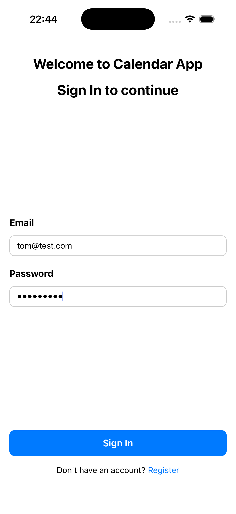
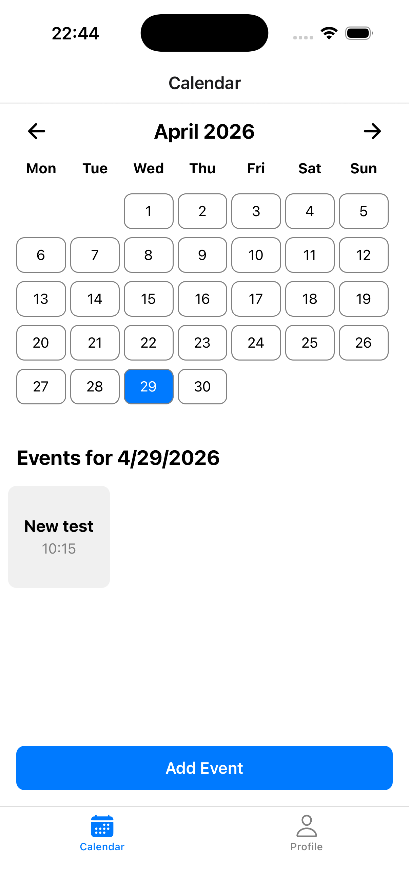
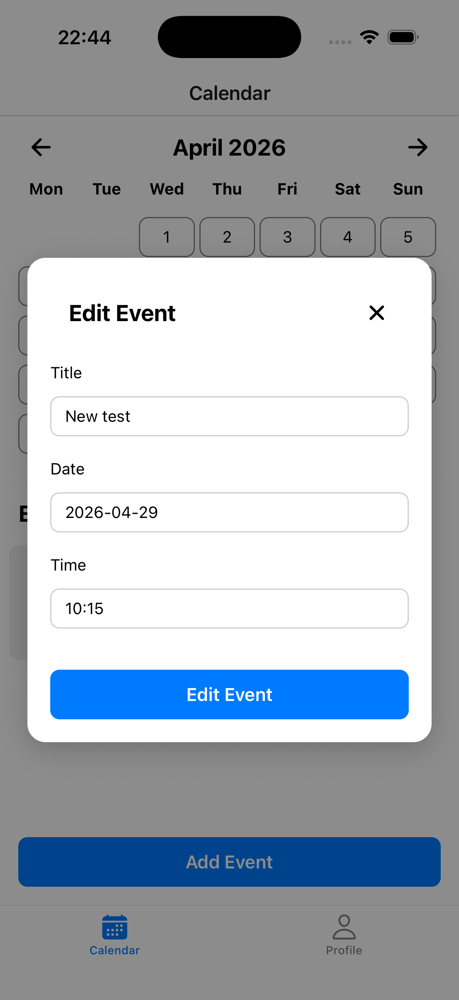
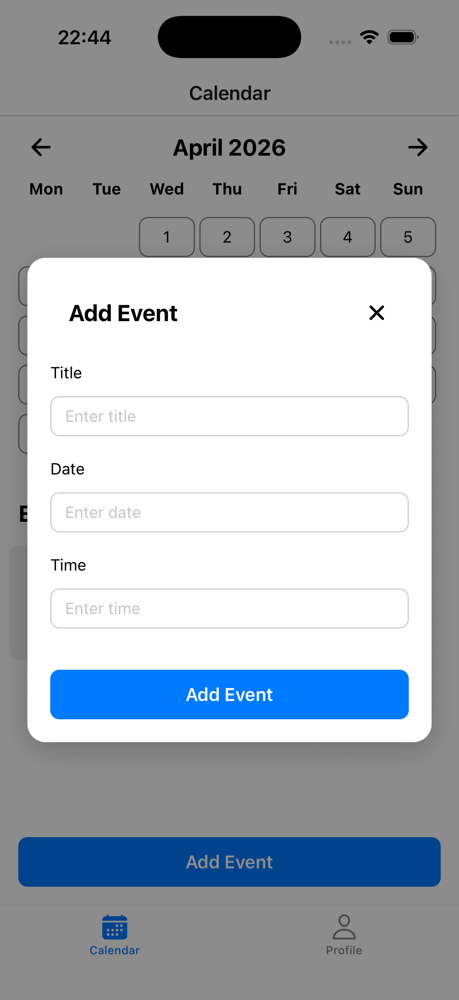
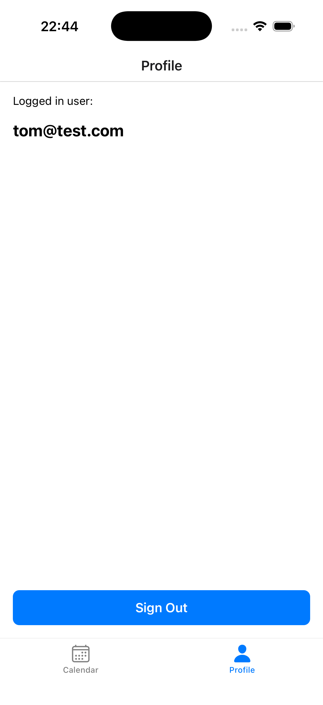

# CalendarApp

CalendarApp is a React Native calendar application with Firebase Firestore-backed events.

## Screenshots

<div style="display: flex; gap: 16px; overflow-x: auto; padding-bottom: 12px;">
  
  
  
  
  
</div>

## Required Software Versions

Use the following versions when setting up the project:

- Node.js: `>= 22.11.0`
- npm: use the version bundled with Node.js 22
- React Native: `0.85.2`
- React: `19.2.3`
- TypeScript: `^5.8.3`
- Firebase JS SDK: `^12.12.1`
- React Native CLI: `20.1.0`

## Android Requirements

- Android Studio: latest stable version recommended
- Android SDK Platform: `36`
- Android SDK Build Tools: `36.0.0`
- Android NDK: `27.1.12297006`
- Kotlin: `2.1.20`
- Gradle: `9.3.1` through the included Gradle wrapper
- Minimum Android SDK: `24`
- Target Android SDK: `36`

## iOS Requirements

- macOS with Xcode installed
- Ruby: `>= 2.6.10`
- CocoaPods: `>= 1.13`, excluding `1.15.0` and `1.15.1`
- Bundler: required for installing the Ruby gems from `Gemfile`

## Main App Dependencies

- `@react-native-async-storage/async-storage`: `^3.0.2`
- `@react-native-community/datetimepicker`: `^9.1.0`
- `@react-navigation/bottom-tabs`: `^7.15.10`
- `@react-navigation/native`: `^7.2.2`
- `@react-navigation/native-stack`: `^7.14.12`
- `@sbaiahmed1/react-native-biometrics`: `^0.15.0`
- `firebase`: `^12.12.1`
- `react-native-safe-area-context`: `^5.7.0`
- `react-native-screens`: `^4.24.0`
- `react-native-vector-icons`: `^10.3.0`

## Installation

Install JavaScript dependencies:

```sh
npm install
```

For iOS, install Ruby and CocoaPods dependencies:

```sh
bundle install
bundle exec pod install --project-directory=ios
```

## Running The App

Start Metro:

```sh
npm start
```

Run on Android:

```sh
npm run android
```

Run on iOS:

```sh
npm run ios
```

## Firebase

The app uses Firebase Firestore for calendar events. Firebase is configured in `src/utils/firebaseConfig.ts`.

Firestore events are stored in the `events` collection with these fields:

- `title`: event title
- `date`: event date in `YYYY-MM-DD` format
- `time`: event time
- `createdAt`: Firestore server timestamp
- `updatedAt`: Firestore server timestamp

The selected-day query filters by `date` and sorts by `time`, so Firestore may require a composite index:

- Collection: `events`
- Fields: `date` ascending, `time` ascending

## Useful Scripts

```sh
npm start
npm run android
npm run ios
npm run lint
npm test
```
